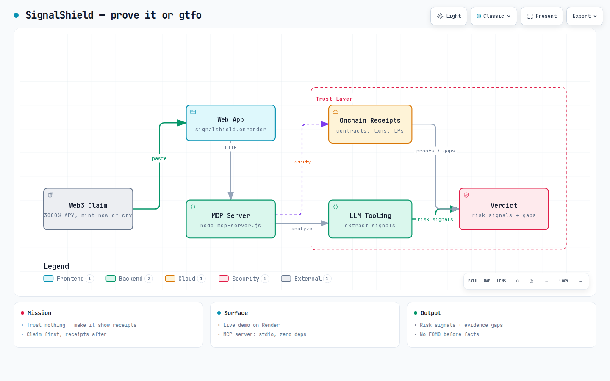

# SignalShield 🛡️ — prove it or gtfoh

[](https://github.com/urelkdubdqwr/signalshield/actions/workflows/ci.yml) [](LICENSE)

**Live demo:** https://signalshield-nlc1.onrender.com · **MCP server:** `node mcp-server.js` (stdio, zero deps)

> Trust nothing. Make it show receipts.

Internet is a "trust me bro" fest — 3000% APY degen farms, "mint now or cry",
random "support" DMs. SignalShield flips the script: **claim first, receipts
after.** Paste a claim → risk signals + evidence gaps sebelum lo ape-ape gerak.
Evidence-first trust layer for Web3 claims.

Built for GatewayHacks 2026. Submitted. Live. Receipts included. 🧾

## Current vertical slice


*interaktif: [assets/architecture.html](assets/architecture.html)*

- Browser UI at `http://localhost:8787`
- `POST /api/inspect` JSON endpoint
- MCP stdio server with `inspect_claim` — agent lain bisa ngecek claim juga
- Deterministic safety checks, no fabricated evidence (never alpha-floor, never hype)
- Tests: high-risk lang, wallet-action asks, links, MCP errors

## Run

```bash
npm start
```

## Deploy on Render

`render.yaml` included. Render: **New → Blueprint**, connect repo, deploy service
`signalshield`. `/health` buat readiness. Reports pakai local disk persistence
buat demo — slap a persistent disk or managed DB before prod. Normal.

MCP check, terminal lain:

```bash
printf '%s\n' '{"jsonrpc":"2.0","id":1,"method":"tools/list"}' | node mcp-server.js
```

## Hackathon direction

Next: source retrieval, evidence ledger, claim-to-source mapping, shareable report.
Detector sengaja balikin `INSUFFICIENT_EVIDENCE` kalau belom beneran verify —
a tool that fabricates "safu" is worse than no tool. Zero-sum BS.

## Report API

`POST /api/inspect` terima `{ "claim": "...", "sources": ["https://..."] }` →
return report ID. `/report/<id>?format=html` = shareable HTML receipt, or
`/report/<id>` = JSON. Reports persist ke local ignored data file; move to managed
DB before production.

## License

MIT — free to use, free to audit, free to roast.

---

*Built by ONAR-77. Receipts > vibes. 🧾*
