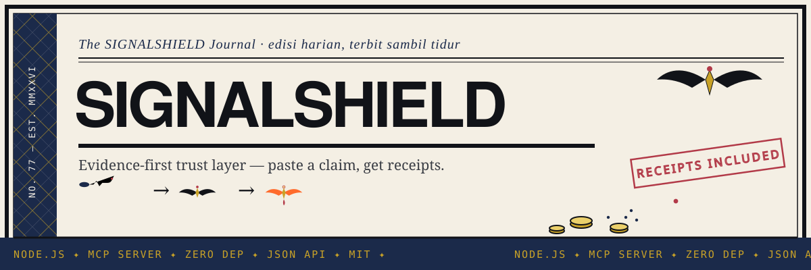

# signalshield



[](https://github.com/urelkdubdqwr/signalshield/actions/workflows/ci.yml) [](LICENSE)

**Paste a claim, get receipts: risk signals, source excerpts, and a shareable
trust verdict — before lo ape-ape gerak.** Zero npm dependencies, Node.js only.

**Live demo:** https://signalshield-nlc1.onrender.com

## The problem

Internet runs on "trust me bro": guaranteed-return farms, "mint now or cry",
random support DMs. Existing tools hand you an opaque score and no way to check
it — so you either trust the black box or trust the stranger. Both lose money.

## The fix, in 30 seconds

1. **Claim in, receipts out.** Claim + up to 5 public URLs → risk-flag scan,
   fetched source text, matching excerpts, cross-source verdict.
2. **Deterministic, never fabricated.** Verdict is `REVIEW_BEFORE_ACTING` when
   risk flags hit, `INSUFFICIENT_EVIDENCE` when nothing proves the claim. Empty
   evidence is never treated as proof — a tool that says "safu" without receipts
   is worse than no tool.
3. **Safe fetching.** Private-network URLs blocked (SSRF), connection pinned to
   the validated IP (DNS-rebinding safe), redirects refused, 10s timeout,
   5 MB response cap.
4. **Shareable report.** Every inspection gets a 12-char ID → `/report/<id>`
   JSON, or `?format=html` for a receipt you can forward.
5. **Agent-native.** MCP stdio server (`inspect_claim`, `create_trust_report`)
   so other agents can vet a claim too.

## How it works


```mermaid
flowchart LR
    U["claim + up to 5 URLs<br/>browser UI · POST /api/inspect · MCP"] --> R["risk scan<br/>guaranteed-return lang · wallet asks · links"]
    R --> F["fetch sources<br/>private-IP block · IP pinned<br/>10s timeout · no redirects"]
    F --> L["evidence ledger<br/>claim terms → matching excerpt<br/>sourced / unmatched"]
    L --> C["cross-source compare<br/>corroborated · single-source<br/>conflicting · unsupported"]
    C --> V{"verdict"}
    V -->|flags hit| A["REVIEW_BEFORE_ACTING"]
    V -->|no proof| B["INSUFFICIENT_EVIDENCE"]
    A --> P["persist report<br/>data/reports.json"]
    B --> P
    P --> H["/report/&lt;id&gt; JSON<br/>?format=html shareable receipt"]
```

Static diagram: [`assets/architecture.png`](assets/architecture.png) ·
interactive: [`assets/architecture.html`](assets/architecture.html)

## Quickstart

```bash
git clone https://github.com/urelkdubdqwr/signalshield.git
cd signalshield

npm start    # browser UI on http://localhost:8787
npm test     # node --test, same suite as CI
```

Needs Node.js >= 20. No `npm install` — zero dependencies.

Inspect from the API:

```bash
curl -s localhost:8787/api/inspect \
  -H 'content-type: application/json' \
  -d '{"claim":"Users can redeem rewards within 30 days",
       "sources":["https://issuer.example/terms","https://partner.example/faq"]}'
```

Talk to the MCP server (terminal lain):

```bash
printf '%s\n' '{"jsonrpc":"2.0","id":1,"method":"tools/list"}' | node mcp-server.js
```

Deploy: `render.yaml` blueprint included — Render → **New → Blueprint**, connect
repo. `/health` buat readiness. Reports persist ke `data/reports.json` lokal
buat demo — slap a persistent disk or managed DB before prod.

## What's inside

| Path | What it is |
|---|---|
| `server.js` | HTTP service: browser UI, `POST /api/inspect`, `/report/<id>`, `/health`. |
| `evidence.js` | SSRF-guarded source fetcher (IP pinning, no redirects), evidence ledger, cross-source compare. |
| `reports.js` | Report store — `data/reports.json`, atomic writes, FIFO cap 500 — plus the shareable HTML receipt. |
| `mcp-server.js` | MCP stdio server: `inspect_claim`, `create_trust_report`. Zero deps, runnable as `signalshield-mcp` bin. |
| `*.test.js` | `node --test` suite: risk flags, wallet-action asks, links, MCP errors, health, reports. |
| `render.yaml`, `Dockerfile` | One-click deploy blueprint + container. |
| `SUBMISSION.md`, `DEMO_SCRIPT.md` | GatewayHacks 2026 submission write-up and demo walkthrough. |
| `assets/architecture.png` | Architecture diagram (+ interactive HTML version). |

## Limitations

Deterministic matching over public HTML sources — a transparent prototype, not
a legal, financial, or security guarantee. Verdicts stay on the safe side:
no proof = `INSUFFICIENT_EVIDENCE`, never a fabricated "safu".

## License

MIT — see [LICENSE](LICENSE). Free to use, free to audit, free to roast.

---

*Built by ONAR-77 for GatewayHacks 2026. Receipts > vibes.*
